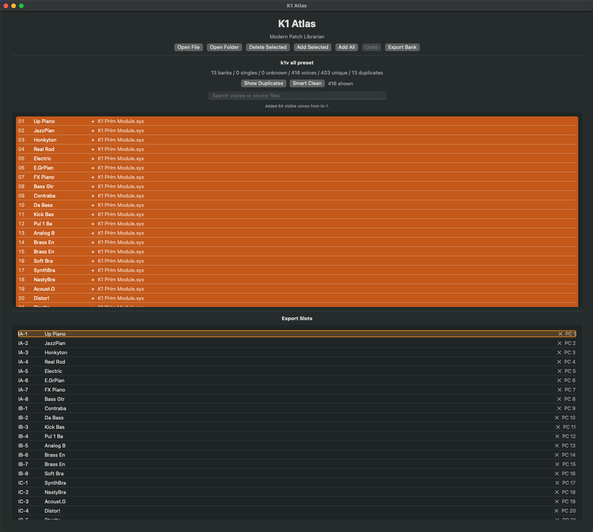

# 🎹 K1 Atlas

Modern Patch Librarian for Kawai K1 / K1m

**Free • Open Source • macOS**

K1 Atlas is a modern patch librarian for the Kawai K1 synthesizer family.

It allows you to browse, search, organize and export SysEx patch banks with a modern macOS interface.

---

## Features

- Load Kawai K1 / K1m SysEx banks
- Load single patches
- Instant patch search
- Duplicate detection
- Smart Clean
- Add Selected
- Add All
- Double-click to add patches
- Drag & Drop Export Slots
- Reorder Export Slots
- Export custom 32-patch banks

---

## Supported Synthesizers

- Kawai K1
- Kawai K1m

---

## How to Use

1. Download Kawai K1/K1m SysEx banks or single patches from the internet, then load them into K1 Atlas using **Open File** or **Open Folder**.
   *(Open Folder is recommended when importing multiple files.)*

2. Select an **Export Slot**, then add a patch by either:
   - Double-clicking it
   - Dragging & dropping it onto an Export Slot

3. Continue until all **32 Export Slots** are filled.

4. Click **Export Bank** to create a new 32-patch SysEx bank.

5. Connect your Mac to your Kawai K1/K1m using a USB MIDI interface, then transfer the exported bank to the synthesizer using **SysEx Librarian** (or any compatible SysEx utility).

> **Tip:** Double-clicking a patch automatically places it into the next available Export Slot.

---

## Download

➡️ **[Download the latest release](../../releases/latest)**

---

## Feedback

Found a bug or have an idea for a new feature?

Please open an Issue on GitHub.

---

## License

MIT License
